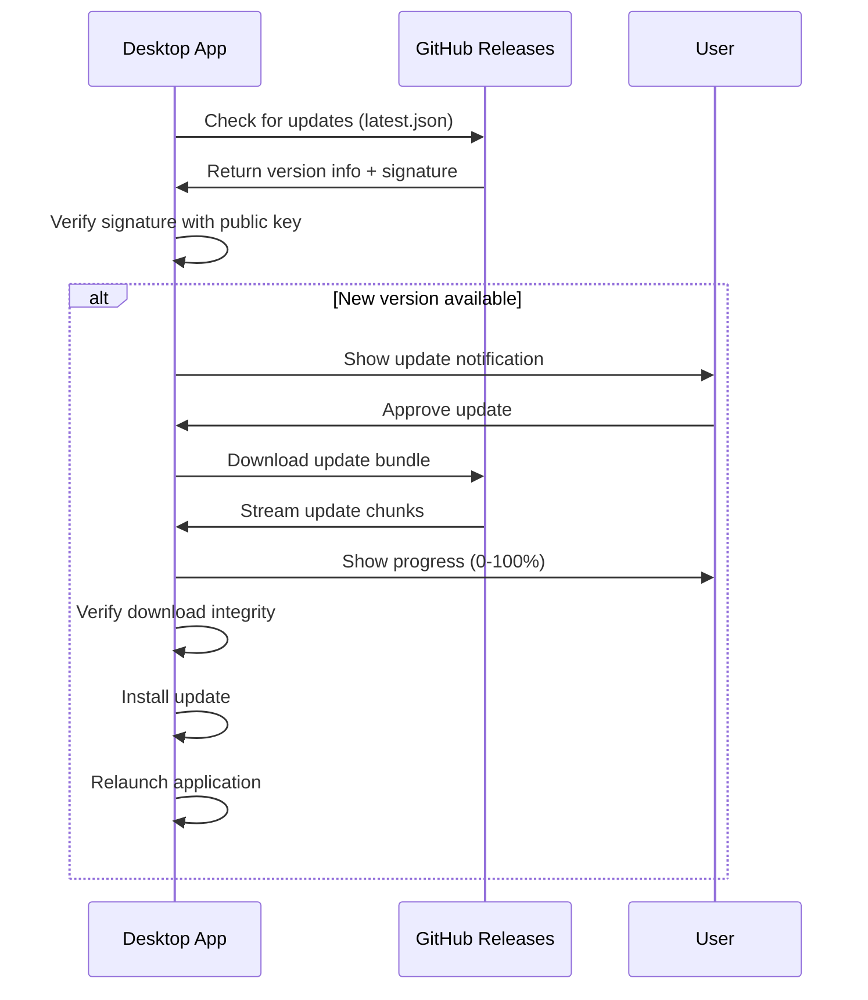

## Overview

The Centinela desktop application includes a built-in **auto-update system** that ensures you always have access to the latest features, improvements, and security patches. Updates are delivered seamlessly through GitHub releases with cryptographic signature verification.

<Info>
  The updater uses Tauri's official plugin (`@tauri-apps/plugin-updater`) and checks for updates from the GitHub repository at `https://github.com/CspmIT/mas-agua-front/releases`.
</Info>

## How Auto-Updates Work

### Update Architecture

The update system follows a secure, user-friendly workflow:



### Security Model

Updates are secured using **cryptographic signatures**:

- Each update bundle is signed with a private key during the build process
- The desktop application verifies signatures using the embedded public key
- Invalid or tampered updates are automatically rejected

<Warning>
  Never disable signature verification. This protects against malicious updates and ensures you only install authentic software from the official repository.
</Warning>

The public key used for verification (embedded in `tauri.conf.json:43`):

```
dW50cnVzdGVkIGNvbW1lbnQ6IG1pbmlzaWduIHB1YmxpYyBrZXk6IENFOUE0OEYyMDA5NDkyNEQKUldSTmtwUUE4a2lhenBraVNOd2cwOU1ZbkxWdVJTU0lEbUZiTkp0VTFRenhtdndVZ1VwUlQ4OG0K
```

## Update Process

When a new version is available, the update process follows these steps:

<Steps>
  <Step title="Update Detection">
    The application checks for updates by querying:
    
    ```
    https://github.com/CspmIT/mas-agua-front/releases/latest/download/latest.json
    ```
    
    This manifest contains version information and download URLs for all platform-specific bundles.
  </Step>
  
  <Step title="User Notification">
    If a newer version is found, a dialog appears:
    
    
    
    The user can choose:
    - **Actualizar** (Update): Proceed with the update immediately
    - **Más tarde** (Later): Dismiss and update later
  </Step>
  
  <Step title="Download Progress">
    If the user approves, the update downloads with real-time progress:
    
    ```
    Actualizando aplicación
    Descargando actualización...
    [████████████████░░░░] 75%
    ```
    
    The progress bar shows download completion percentage.
  </Step>
  
  <Step title="Installation">
    Once downloaded and verified, the update is installed automatically:
    
    ```
    Instalando actualización
    La aplicación se reiniciará automáticamente…
    ```
  </Step>
  
  <Step title="Automatic Relaunch">
    The application automatically restarts to complete the update. Your session state and configuration are preserved.
  </Step>
</Steps>

<Note>
  The entire update process typically takes 1-3 minutes, depending on your internet connection speed.
</Note>

## Update Implementation

The update system is implemented in `/home/daytona/workspace/source/src/hooks/useUpdater.js:1` using the `check()` and `downloadAndInstall()` APIs:

### Checking for Updates

```javascript
import { check } from '@tauri-apps/plugin-updater'

const update = await check()

if (update) {
  // New version available
  console.log(`Update available: ${update.version}`)
}
```

### Download with Progress Tracking

The `downloadAndInstall()` method emits events during the download:

<CodeGroup>
  ```javascript Started Event
  case 'Started':
    contentLength = event.data.contentLength
    // Total bytes to download
    console.log(`Downloading ${contentLength} bytes`)
  ```
  
  ```javascript Progress Event
  case 'Progress':
    downloaded += event.data.chunkLength
    const percent = Math.floor((downloaded / contentLength) * 100)
    updateProgress(percent)  // Update UI
  ```
  
  ```javascript Finished Event
  case 'Finished':
    // Download complete, installing...
    showInstallMessage()
  ```
</CodeGroup>

### Error Handling

The updater includes robust error handling:

```javascript
try {
  await update.downloadAndInstall(eventHandler)
  await relaunch()  // Restart the app
} catch (error) {
  console.error('Updater error:', error)
  showUpdateError(
    'No se pudo completar la actualización. '
    + 'Verificá tu conexión e intentá nuevamente.'
  )
}
```

<Warning>
  If the download doesn't start within 20 seconds, the updater automatically times out and shows an error. This prevents the UI from hanging on network issues.
</Warning>

## Manual Update Check

By default, the application checks for updates:

- On application startup
- Periodically while running (implementation-dependent)

To manually check for updates:

1. Open the application menu
2. Navigate to **Help** > **Check for Updates**
3. The updater will query GitHub and notify you of any available updates

<Info>
  Manual update checks use the same secure verification process as automatic checks.
</Info>

## Update Configuration

The update system is configured in `src-tauri/tauri.conf.json:38-44`:

```json
"updater": {
  "active": true,
  "endpoints": [
    "https://github.com/CspmIT/mas-agua-front/releases/latest/download/latest.json"
  ],
  "dialog": true,
  "pubkey": "dW50cnVzdGVkIGNvbW1lbnQ6..."
}
```

### Configuration Options

| Option | Value | Description |
|--------|-------|-------------|
| `active` | `true` | Enables the auto-update system |
| `endpoints` | Array | URLs to check for update manifests |
| `dialog` | `true` | Shows built-in update dialog (in addition to custom UI) |
| `pubkey` | String | Public key for signature verification |

## Platform-Specific Updates

The updater automatically downloads the correct bundle for your platform:

<Tabs>
  <Tab title="Windows">
    **Bundle Type**: `.msi.zip`
    
    The updater downloads and extracts the MSI installer, then runs it silently with elevated privileges if needed.
    
    **Location**: Updates are staged in:
    ```
    %LOCALAPPDATA%\com.masagua.desktop\updates
    ```
  </Tab>
  
  <Tab title="macOS">
    **Bundle Type**: `.app.tar.gz`
    
    The updater downloads the tarball, verifies the signature, extracts the new app bundle, and replaces the existing one.
    
    **Location**: Updates are staged in:
    ```
    ~/Library/Application Support/com.masagua.desktop/updates
    ```
  </Tab>
  
  <Tab title="Linux">
    **Bundle Type**: `.AppImage.tar.gz`
    
    The updater downloads and extracts the new AppImage, making it executable.
    
    **Location**: Updates are staged in:
    ```
    ~/.local/share/com.masagua.desktop/updates
    ```
  </Tab>
</Tabs>

## Troubleshooting Updates

### Update Check Fails

If the application can't check for updates:

**Possible Causes**
- No internet connection
- GitHub is unreachable
- Firewall blocking HTTPS requests
- Proxy configuration issues

**Solution**

<Steps>
  <Step title="Verify Internet Connection">
    Ensure you can access `https://github.com` in your browser.
  </Step>
  
  <Step title="Check Firewall">
    Allow the application to make outbound HTTPS connections to `github.com`.
  </Step>
  
  <Step title="Proxy Configuration">
    If behind a corporate proxy, configure system proxy settings. Tauri respects system proxy configuration.
  </Step>
</Steps>

### Download Fails or Times Out

If the update download fails:

1. **Check Available Disk Space**: Ensure you have at least 500 MB free
2. **Retry the Update**: Use **Help** > **Check for Updates** to try again
3. **Manual Download**: Visit the [Releases page](https://github.com/CspmIT/mas-agua-front/releases) and download/install manually

<Note>
  The updater has a 20-second timeout for download initiation. On slow connections, consider manual installation.
</Note>

### Signature Verification Fails

If you see a signature verification error:

<Warning>
  **DO NOT** proceed with the installation. This indicates the update bundle may be corrupted or tampered with.
</Warning>

**Steps to resolve**:

1. Wait and try again later (GitHub may have had upload issues)
2. Report the issue to the development team
3. Download and verify the installer manually from GitHub releases

### Application Won't Relaunch

If the application fails to restart after update:

**Windows**
```powershell
# Manually launch from Start Menu or:
cd "C:\Program Files\Mas Agua"
.\"Mas Agua.exe"
```

**macOS**
```bash
open /Applications/Mas\ Agua.app
```

**Linux**
```bash
mas-agua  # If installed via DEB/RPM
# or
./mas-agua_1.0.4_amd64.AppImage  # For AppImage
```

## Update Rollback

Currently, the updater does not support automatic rollback. If you experience issues after an update:

<Steps>
  <Step title="Uninstall Current Version">
    Follow the [uninstallation instructions](/desktop/installation#uninstallation) for your platform.
  </Step>
  
  <Step title="Download Previous Version">
    Visit the [Releases page](https://github.com/CspmIT/mas-agua-front/releases) and select the previous version.
  </Step>
  
  <Step title="Reinstall">
    Install the previous version following the [installation guide](/desktop/installation).
  </Step>
  
  <Step title="Report the Issue">
    File a bug report on GitHub with details about what went wrong with the update.
  </Step>
</Steps>

## Release Channels

Currently, the updater only supports the **stable** release channel. All updates come from official GitHub releases.

Future versions may support:

- **Beta Channel**: Early access to new features
- **LTS Channel**: Long-term support versions with extended maintenance

## Building Update Bundles

For developers who need to create custom update bundles:

### Prerequisites

Install the Tauri CLI with updater support:

```bash
cargo install tauri-cli --version "^2.0"
```

### Generate Signing Keys

```bash
cd src-tauri
tauri signer generate -w ~/.tauri/masagua.key
```

This creates a public/private key pair for signing updates.

### Build with Updater Artifacts

The `tauri.conf.json:15` configuration enables updater artifact generation:

```json
"createUpdaterArtifacts": true
```

Build the application:

```bash
npm run tauri build
```

This generates:

- Platform-specific installers (`.msi`, `.deb`, `.dmg`, etc.)
- Update bundles (`.msi.zip`, `.app.tar.gz`, `.AppImage.tar.gz`)
- Signature files (`.sig`)
- Update manifest (`latest.json`)

### Publish to GitHub Releases

<Steps>
  <Step title="Create a Release">
    Create a new release on GitHub with a semantic version tag (e.g., `v1.0.5`).
  </Step>
  
  <Step title="Upload Artifacts">
    Upload all generated bundles, signatures, and the `latest.json` manifest.
  </Step>
  
  <Step title="Publish">
    Mark the release as published. The updater will detect it on the next check.
  </Step>
</Steps>

<Info>
  The `latest.json` manifest is automatically generated by Tauri CLI and includes version info, download URLs, and signatures for all platforms.
</Info>

## Best Practices

### For Users

- **Keep Auto-Updates Enabled**: Ensure you receive security patches promptly
- **Update Promptly**: Apply updates when notified to benefit from bug fixes
- **Stable Internet**: Ensure a stable connection before initiating updates
- **Don't Interrupt**: Allow updates to complete without interrupting the process

### For Administrators

- **Test Updates**: Test new versions in a staging environment before deploying
- **Staged Rollout**: For large deployments, update systems in phases
- **Monitor Logs**: Check update logs if issues arise
- **Backup Configurations**: Although configs are preserved, maintain backups

## FAQ

**Q: How often does the app check for updates?**

A: The application checks for updates on startup and may check periodically during runtime.

**Q: Can I disable auto-updates?**

A: Currently, auto-updates cannot be disabled through the UI. This ensures all users receive critical security updates.

**Q: Do updates require administrator privileges?**

A: On Windows and macOS, updates may require elevated privileges to replace application files. On Linux, it depends on the installation method (system-wide vs. user-local).

**Q: Will my settings be preserved after an update?**

A: Yes, all user data, preferences, and configurations are stored separately and persist through updates.

**Q: Can I update offline?**

A: No, updates require an internet connection to download. However, you can download installers manually and install offline.

**Q: What happens if an update fails?**

A: The current version remains installed and functional. You can retry the update or install manually.

---

## Next Steps

- Review the [Installation Guide](/desktop/installation) for initial setup
- Explore [Desktop Application Overview](/desktop/overview) for feature details
- Learn about [Dashboard Configuration](/dashboard/overview) to customize your monitoring experience
